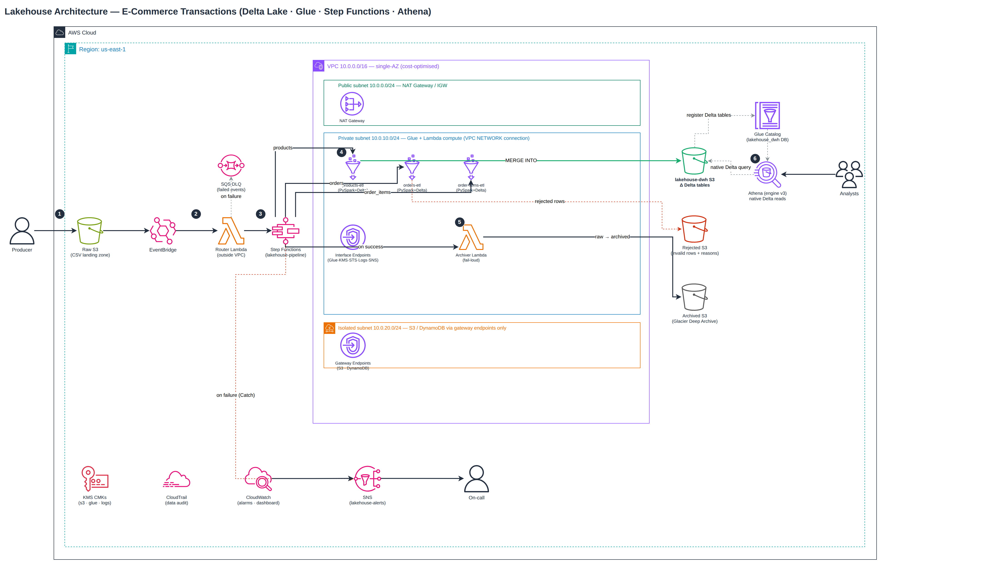

# Lakehouse Architecture for E-Commerce Transactions

A production-grade **Lakehouse** on AWS that ingests raw e-commerce transactional data from S3,
cleans and deduplicates it using **Delta Lake** on **AWS Glue + PySpark**, and exposes it for
downstream analytics through **Amazon Athena**. Orchestrated end-to-end by **AWS Step Functions**
with CI/CD on **GitHub Actions**.

---

## Architecture



### Diagram Walkthrough

The numbered badges in the diagram correspond to the main pipeline flow:

1. **Raw landing:** The producer uploads CSV files (products, orders, order_items) into the Raw S3
   bucket. An S3 `Object Created` event is emitted automatically.
2. **Event routing:** EventBridge captures the event and invokes the **Router Lambda** (outside
   VPC). Delivery failures after retries land in the **SQS dead-letter queue** — no event is
   silently lost.
3. **Orchestration trigger:** The Router calls Step Functions `StartExecution` and hands off the
   payload (bucket, key, dataset, run date). Step Functions orchestrates every subsequent step.
4. **Delta ETL (in VPC):** Three **Glue PySpark + Delta Lake** jobs run inside the private subnet
   via a Glue NETWORK connection. Each job:
   - Reads raw CSV with an explicit schema (no `inferSchema` — schema enforcement at read time).
   - Validates rows: no-null PKs, parseable timestamps, value ranges; rejected rows written to
     **Rejected S3** with reasons logged.
   - Deduplicates by PK (window function, latest-wins).
   - Writes to **lakehouse-dwh/** via Delta **MERGE INTO** (upsert — idempotent re-runs).
   - Delta enabled via `--datalake-formats delta` (bundled in Glue 4.0; no PyPI / internet needed).
5. **Archival (in VPC):** On all-jobs success, the **Archive Lambda** (VPC-attached) moves source
   files `raw/ → archived/`. It fails loud on any error so Step Functions `Catch` can alert.
6. **Analytics:** Delta tables are registered in the **Glue Data Catalog**. **Athena (engine v3)**
   reads them natively via the Delta transaction log. Analysts query directly without ETL re-runs.

Failures at any step trigger an SNS alert to on-call. **CloudTrail** audits all data-movement
events (S3 + Glue + SFN).

---

## Data Flow

| Zone | Bucket | Format | Description |
|---|---|---|---|
| Raw | `raw-<suffix>` | CSV | Incoming files, immutable source of truth |
| Processed | `lakehouse-dwh-<suffix>` | Delta | ACID tables, deduped, schema-enforced |
| Rejected | `rejected-<suffix>` | Parquet | Invalid rows with rejection reasons |
| Archived | `archived-<suffix>` | CSV | Source files after successful ingestion |

### Delta Table Schema

| Table | PK | Partition | Notes |
|---|---|---|---|
| `products` | `product_id` | none | Small dim, broadcast-friendly |
| `orders` | `order_id` | `date` | Daily partition for time-range pruning |
| `order_items` | `id` | `date` | Daily partition |

---

## Tech Stack

| Layer | Service |
|---|---|
| Orchestration | AWS Step Functions (Standard) |
| ETL | AWS Glue 4.0 (PySpark + Delta Lake), Glue Data Catalog |
| Storage | Amazon S3 (Delta format), SSE-KMS |
| Event routing | Amazon EventBridge, Amazon SQS (dead-letter queue) |
| Compute | AWS Lambda (Python 3.12, VPC-attached archiver) |
| Analytics | Amazon Athena (engine v3, native Delta) |
| Security | KMS CMKs, IAM least privilege, 3-tier VPC + PrivateLink (single-AZ for cost) |
| Observability | CloudWatch (dashboard + alarms), CloudTrail (audit), SNS alerts |
| IaC | Terraform 1.7+, modular composition |
| CI/CD | GitHub Actions (pytest + terraform fmt/validate/plan, OIDC, plan-only) |

---

## Repository Layout

```
lakehouse-ecommerce-pipeline/
├── glue/
│   ├── common/
│   │   ├── schemas.py          # Explicit StructType per dataset
│   │   ├── validation.py       # Null-PK, timestamp, range rules; split valid/rejected
│   │   └── delta_io.py         # Window dedup, Delta MERGE upsert, rejected writer
│   ├── products_etl.py
│   ├── orders_etl.py
│   └── order_items_etl.py
├── lambda/handlers/
│   ├── router.py               # EventBridge → Step Functions (outside VPC)
│   └── archiver.py             # raw/ → archived/ on success (VPC-attached, fail-loud)
├── tests/
│   ├── conftest.py
│   ├── requirements.txt
│   ├── test_router_lambda.py
│   ├── test_archive_lambda.py
│   ├── test_schemas.py
│   └── test_validation.py
├── scripts/
│   ├── convert_xlsx_to_csv.py  # Convert orders/order_items .xlsx → CSV
│   ├── generate_dirty_data.py  # Inject nulls/dupes/orphan FKs for testing
│   └── upload_raw.py           # Upload CSVs to S3 raw zone (simulate ingestion)
├── docs/
│   ├── lakehouse-architecture.drawio.xml
│   └── lakehouse-architecture.png
├── terraform/
│   ├── bootstrap/              # State backend (S3 + DynamoDB + KMS + GitHub OIDC)
│   ├── envs/dev/               # Root composition for dev environment
│   └── modules/
│       ├── kms/                # CMKs: s3-data-lake, glue, logs
│       ├── networking/         # 3-tier VPC, single-AZ, PrivateLink endpoints
│       ├── s3-data-lake/       # 7 buckets with lifecycle + SSE-KMS
│       ├── iam-roles/          # Least-privilege roles for all compute
│       ├── glue-jobs/          # 3 Delta-enabled jobs + NETWORK connection
│       ├── glue-catalog/       # lakehouse-dwh DB + Delta table registrations
│       ├── lambda-functions/   # Router + Archiver + SQS DLQ
│       ├── step-functions/     # Standard state machine ASL
│       ├── eventbridge/        # S3 Object Created → Router + DLQ
│       ├── athena/             # Analytics workgroup (SSE-KMS results)
│       └── observability/      # Dashboard, alarms, CloudTrail, SNS
├── config/backend-dev.hcl.example
├── statemachine/               # Optional standalone SFN ASL
└── .github/workflows/ci.yml    # pytest → terraform fmt/validate/plan
```

---

## Setup

### Prerequisites
- AWS account with admin permissions
- Terraform 1.7+
- Python 3.12+
- GitHub repository (for CI/CD)

### 1. Prepare the data

```bash
# Convert xlsx → CSV (run once)
python scripts/convert_xlsx_to_csv.py

# Optional: generate dirty data to test validation logic
python scripts/generate_dirty_data.py
```

### 2. Bootstrap state backend

```bash
cd terraform/bootstrap
cp terraform.tfvars.example terraform.tfvars
# Edit with your values
terraform init && terraform apply
```

### 3. Set GitHub Secrets

| Secret | Description |
|---|---|
| `AWS_TERRAFORM_ROLE_ARN` | From bootstrap output |
| `AWS_ACCOUNT_ID` | Your AWS account ID |

### 4. Deploy dev environment

```bash
cd terraform/envs/dev
cp ../../../config/backend-dev.hcl.example backend-dev.hcl
# Edit backend-dev.hcl with your state bucket details
cp terraform.tfvars.example terraform.tfvars
# Edit terraform.tfvars with your values (bucket_suffix, alert_emails)
terraform init -backend-config=backend-dev.hcl
terraform plan
terraform apply
```

### 5. Simulate ingestion

```bash
python scripts/upload_raw.py --bucket <your-raw-bucket>
# Watch the Step Functions execution in the AWS console
```

---

## Testing

```bash
pip install -r tests/requirements.txt
python -m pytest tests/ -v --ignore=tests/test_validation.py   # fast (no Spark)
python -m pytest tests/ -v                                      # all (requires PySpark)
```

Test coverage:
- **test_router_lambda**: valid dataset keys start execution; non-raw keys skipped
- **test_archive_lambda**: success archives and deletes; copy failure raises RuntimeError (fail-loud)
- **test_schemas**: exact field names for all 3 StructType schemas (no Spark needed)
- **test_validation**: null-PK, bad-timestamp, and range-violation rejection logic

---

## Design Decisions

### Why Delta Lake instead of plain Parquet?
Delta gives us ACID transactions, schema enforcement, `MERGE INTO` for idempotent upserts, and
time-travel — all essential for a reliable lakehouse. Plain Parquet can't guarantee exactly-once
semantics on re-runs; Delta's transaction log can.

### Why single-AZ by default?
Interface VPC endpoints are billed per-AZ (~$7/AZ/mo each). With ~10 endpoints, a second AZ would
add ~$70–80/mo for HA this course/dev project doesn't need. The subnet variables are list-typed so
multi-AZ is a one-line change when needed.

### Why is the Router Lambda outside the VPC?
It only calls the Step Functions API — no S3/DynamoDB access. Attaching it to the VPC would cost an
ENI and add cold-start latency for no security benefit. The Archiver Lambda is VPC-attached because
it reads/writes S3 via the gateway endpoint (private path).

### Why `--datalake-formats delta` instead of PyPI?
Glue 4.0 bundles the Delta JARs natively. This means the Spark jobs run fully inside the private
subnet with no internet egress — unlike a `pip install` approach, which would require a NAT or VPC
endpoint for PyPI.

### Why job bookmarks disabled?
Delta MERGE INTO is the idempotency mechanism. Bookmarks (incremental "only new data") fight the
explicit-partition + overwrite design and add dead, misleading config.

---

## Outputs (after `terraform apply`)

| Output | Description |
|---|---|
| `raw_bucket_id` | Raw S3 bucket (CSV landing zone) |
| `dwh_bucket_id` | lakehouse-dwh S3 bucket (Delta tables) |
| `step_functions_arn` | State machine ARN |
| `sns_topic_arn` | Pipeline alert topic |
| `glue_catalog_database` | Glue DB name for Athena queries |
| `pipeline_dlq_arn` | Dead-letter queue ARN |

---

## Cleanup

```bash
cd terraform/envs/dev
terraform destroy
```

> S3 buckets with versioning enabled may need manual emptying before `terraform destroy` succeeds.
